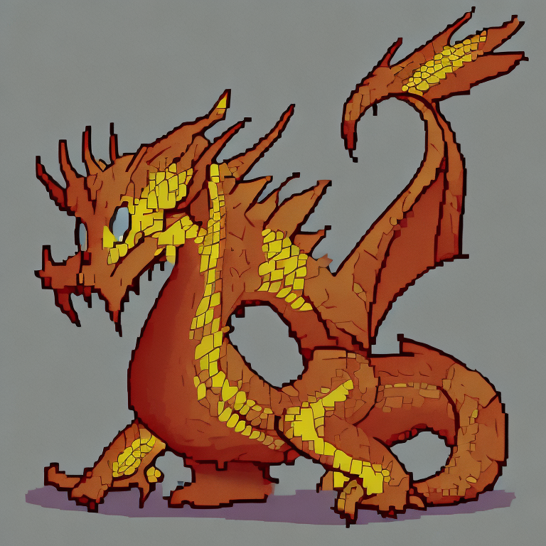
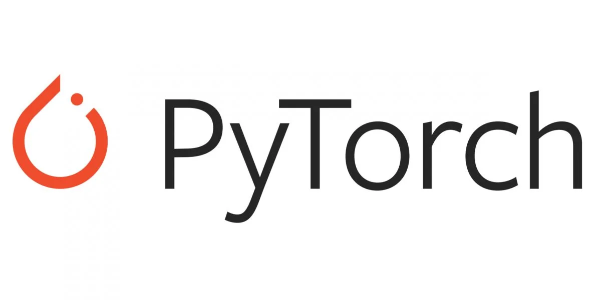
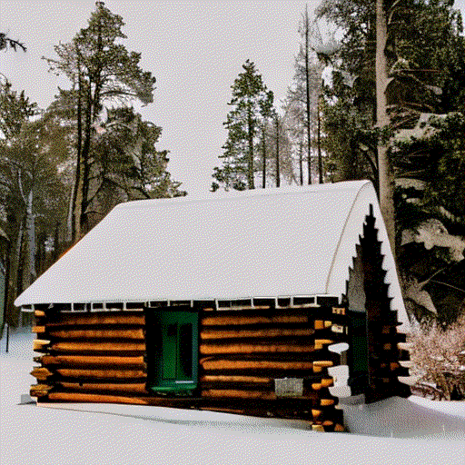

<a name="readme-top"></a>

[![Contributors][contributors-shield]][contributors-url]
[![Forks][forks-shield]][forks-url]
[![Stargazers][stars-shield]][stars-url]
[![MIT License][license-shield]][license-url]


<!-- PROJECT LOGO -->
<br />
<div align="center">
  <a href="https://github.com/sunil-2000/text-to-pixel-gif">
    
  </a>

  <h3 align="center">Pixel Giffusion (text-to-pixel-GIF)</h3>

  <p align="center">
    Generating Pixel-Art-Style Gifs from Text Prompts
    <br />
    <a href="https://github.com/sunil-2000/text-to-pixel-gif#examples"><strong>Examples »</strong></a>
    <br />
    <br />
  </p>
</div>


<!-- TABLE OF CONTENTS -->
<details>
  <summary>Table of Contents</summary>
  <ol>
    <li>
      <a href="#about-the-project">About The Project</a>
      <ul>
        <li><a href="#built-with">Built With</a></li>
        <li><a href="#datasets--models">Datasets & Models</a></li>
        <li><a href="#examples">Examples</a></li>
      </ul>
    </li>
    <li>
      <a href="#getting-started">Getting Started</a>
      <ul>
        <li><a href="#prerequisites">Prerequisites</a></li>
        <li><a href="#installation">Installation</a></li>
      </ul>
    </li>
    <li><a href="#license">License</a></li>
    <li><a href="#contact">Contact</a></li>
    <li><a href="#acknowledgments">Acknowledgments</a></li>
  </ol>
</details>

<!-- ABOUT THE PROJECT -->
## About The Project

Generative AI is a fast-growing niche in the world of machine learning with applications in various industries including AI generated art. To expand on this niche, we have fine-tuned an image diffusion model to generate pixel-style GIFs that morph between two images from provided text prompts. This involved fine-tuning an existing diffusion model on pixel-art dataset(s), generating two images from the first and second prompt, and interpolating their prompts and latent noise tensors together to morph the generated images. To create pixel-art GIFs we extracted the interpolation outputs and stitched the outputs together. This research aims to narrow down the use cases of diffusion models and contribute to the field of generative modeling.

<p align="right">[<a href="#readme-top">Back to Top</a>]</p>

### Built With

* <a href="https://pytorch.org/"></a>
* <a href="https://colab.research.google.com/"></a>
* <a href="https://huggingface.co/"></a>

<p align="right">[<a href="#readme-top">Back to Top</a>]</p>

### Datasets & Models

The datasets that we experimented with for the fine-tuning process are listed below. They are all on HuggingFace.

1. [jainr3/diffusiondb-pixelart](https://huggingface.co/datasets/jainr3/diffusiondb-pixelart): This is a subset of the DiffusionDB dataset containing image samples that have been passed through the [pixelatorapp.com](http://pixelatorapp.com/) tool to make "pixel-art" style images.

2. [sunilSabnis/pixelart](https://huggingface.co/datasets/sunilSabnis/pixelart): This is a dataset of pixel-style art generated from the stable-diffusion2-1 model itself. The prompts were selected from [andyyang/stable_diffusion_prompts_2m](https://huggingface.co/datasets/andyyang/stable_diffusion_prompts_2m).

3. [jiovine/pixel-art-nouns-2k](https://huggingface.co/datasets/jiovine/pixel-art-nouns-2k): This is a class-specific dataset of pixel-style art; more specifically the images are of cartoon characters.

The models that were obtained as a result of fine-tuning with these datasets are listed below. These are all on HuggingFace.

1. [jainr3/sd-diffusiondb-pixelart-model-lora](https://huggingface.co/jainr3/sd-diffusiondb-pixelart-model-lora): These are LoRA adaption weights for stabilityai/stable-diffusion-2-1. The weights were fine-tuned on the jainr3/diffusiondb-pixelart dataset.

2. [jainr3/sd-pixelart-model-lora](https://huggingface.co/jainr3/sd-pixelart-model-lora): These are LoRA adaption weights for stabilityai/stable-diffusion-2-1. The weights were fine-tuned on the sunilSabnis/pixelart dataset.

3. [jainr3/sd-nouns-model-lora](https://huggingface.co/jainr3/sd-nouns-model-lora): These are LoRA adaption weights for stabilityai/stable-diffusion-2-1. The weights were fine-tuned on the jiovine/pixel-art-nouns-2k dataset.

4. [jainr3/sd-diffusiondb-pixelart-v2-model-lora](https://huggingface.co/jainr3/sd-diffusiondb-pixelart-v2-model-lora) : These are LoRA adaption weights for stabilityai/stable-diffusion-2-1. The weights were fine-tuned on the jainr3/diffusiondb-pixelart dataset. This model has been trained for 30 epochs while the jainr3/sd-diffusiondb-pixelart-model-lora model was trained on only 5 epochs.

<p align="right">[<a href="#readme-top">Back to Top</a>]</p>

### Examples

1. First text prompt: "Snowy cabin in the woods"

   Second text prompt: "Ancient castle with a fire breathing dragon above"

   See [here](./colab-notebooks/MorphImages1.ipynb) for more details.

<p align="center">

</p>

2. First text prompt: "The sun shining brightly"

   Second text prompt: "A full moon glowing brightly"

   See [here](./colab-notebooks//MorphImages2.ipynb) for more details.

<p align="center">

</p>

<p align="right">[<a href="#readme-top">Back to Top</a>]</p>

<!-- GETTING STARTED -->
## Getting Started

To get a local copy up and running follow these simple example steps.

### Prerequisites

Create a fresh conda environment. Then install the following. A powerful GPU is necessary for most parts, so one may opt to use Google Colaboratory where an A100 high-RAM GPU is easily available with the Colab Pro plan.

* Pyxelate Library: https://github.com/sedthh/pyxelate
  ```
  pip install git+https://github.com/sedthh/pyxelate.git --upgrade
  ```
* Requirements
  ```
  pip install -r requirements.txt
  ```

### Installation

1. Clone the repo
   ```sh
   git clone https://github.com/sunil-2000/text-to-pixel-gif.git
   ```

Model Fine-Tuning

1. Obtain a Huggingface API Key from https://huggingface.co/ and save for later.

2. Obtain a Wandb API Key from https://wandb.ai/ and save for later.

3. Utilize the fine-tuning scripts located in the ```colab-notebooks``` folder. There are a number of example scripts for the different experiments that we performed which are for example using different datasets or training for shorter/longer. The API keys will be needed in these scripts when prompted.

GIF Generation

1. abc

2. abc

<p align="right">[<a href="#readme-top">Back to Top</a>]</p>

<!-- LICENSE -->
## License

Distributed under the MIT License. See `LICENSE.txt` for more information.

<p align="right">[<a href="#readme-top">Back to Top</a>]</p>

<!-- CONTACT -->
## Contact

[Rahul Jain](https://github.com/jainr3), [Sunil Sabnis](https://github.com/sunil-2000), [Joseph Iovine](https://github.com/jiovine), [Kenneth Alvarez](https://github.com/Kalva014), and [Carlos Ponce](https://github.com/cponce1600)

Project Link: [https://github.com/sunil-2000/text-to-pixel-gif](https://github.com/sunil-2000/text-to-pixel-gif)

<p align="right">[<a href="#readme-top">Back to Top</a>]</p>

<!-- ACKNOWLEDGMENTS -->
## Acknowledgments

This project was created as a part of the CS 5787 Deep Learning Final Project for the Spring 2023 semester under the guidance of Professor Alex Jaimes.

<p align="right">[<a href="#readme-top">Back to Top</a>]</p>

<!-- MARKDOWN LINKS & IMAGES -->
[contributors-shield]: https://img.shields.io/github/contributors/sunil-2000/text-to-pixel-gif.svg?style=for-the-badge
[contributors-url]: https://github.com/sunil-2000/text-to-pixel-gif/graphs/contributors
[forks-shield]: https://img.shields.io/github/forks/sunil-2000/text-to-pixel-gif.svg?style=for-the-badge
[forks-url]: https://github.com/sunil-2000/text-to-pixel-gif/network/members
[stars-shield]: https://img.shields.io/github/stars/sunil-2000/text-to-pixel-gif.svg?style=for-the-badge
[stars-url]: https://github.com/sunil-2000/text-to-pixel-gif/stargazers
[license-shield]: https://img.shields.io/github/license/sunil-2000/text-to-pixel-gif.svg?style=for-the-badge
[license-url]: https://github.com/sunil-2000/text-to-pixel-gif/blob/main/LICENSE.txt
